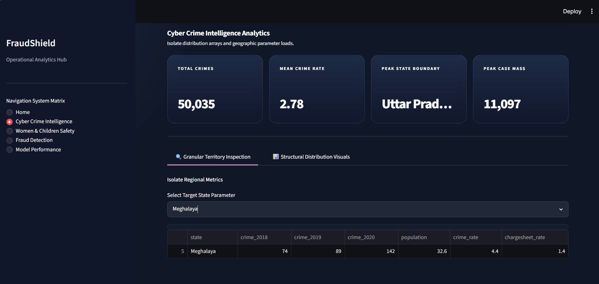
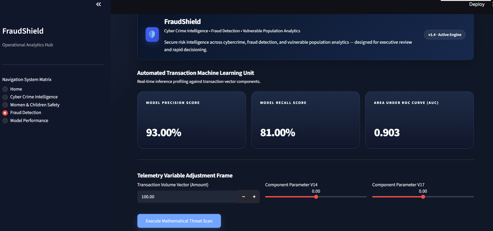

# 🛡️ FraudShield AI

## Cyber Crime Intelligence & Fraud Detection Platform

FraudShield AI is an end-to-end cybersecurity analytics platform that combines Cyber Crime Intelligence, Women & Children Safety Analytics, PostgreSQL-powered data management, and Machine Learning-based Fraud Detection.

---

## 🚀 Project Overview

The project analyzes cybercrime datasets across India, identifies vulnerable populations, and predicts fraudulent transactions using Machine Learning.

FraudShield AI transforms raw cybercrime data into actionable intelligence through:

- Exploratory Data Analysis (EDA)
- PostgreSQL Database Integration
- SQL Analytics
- Machine Learning
- Interactive Streamlit Dashboard

---

## 📊 Features

### Cyber Crime Intelligence

- State-wise cybercrime analysis
- Crime rate comparison
- High-risk state identification
- Interactive visualizations

### Women & Children Safety Analytics

- Vulnerable Population Index
- Risk hotspot detection
- Comparative analysis of cyber crimes

### Fraud Detection AI

- Random Forest Classifier
- Fraud probability prediction
- Feature importance analysis

### Database Analytics

- PostgreSQL Integration
- SQL-based querying
- Structured analytics workflow

---

## 🛠️ Technology Stack

| Category | Tools |
|-----------|---------|
| Programming | Python |
| Database | PostgreSQL |
| Analytics | Pandas, NumPy |
| Machine Learning | Scikit-Learn |
| Visualization | Plotly |
| Dashboard | Streamlit |
| Database Connectivity | SQLAlchemy |

---

## 📂 Datasets Used

### Cyber Crime in India

- State-wise cyber crime statistics
- Crime rates
- Chargesheet rates

### Cyber Crime Against Women

- Women-specific cyber crime incidents

### Cyber Crime Against Children

- Child-specific cyber crime incidents

### Credit Card Fraud Dataset

- 284,807 transactions
- Highly imbalanced fraud detection dataset

---

## 🤖 Machine Learning Model

### Random Forest Classifier

Performance:

| Metric | Score |
|----------|----------|
| Precision | 93% |
| Recall | 81% |
| ROC-AUC | 0.903 |

### Top Predictive Features

- V17
- V14
- V12
- V10
- V16

---

## 🗄️ Project Architecture

```text
Datasets
    ↓
Data Cleaning
    ↓
Exploratory Data Analysis
    ↓
PostgreSQL Database
    ↓
Machine Learning
    ↓
Streamlit Dashboard
```

---

## 📸 Dashboard Screenshots

### Home Dashboard


### Cyber Crime Intelligence

,(screenshots/cybercrime2.png),((screenshots/cybercrime3.png))

### Women & Children Safety Analytics

.png),(screenshots/women and children safety.png),(screenshots/women and children safety2.png)

### Fraud Detection AI

,(screenshots/fraud detection2.png)

## Model Performance
(screenshots/model performance.png)
---

## 📈 Key Insights

- Identified cybercrime hotspots across Indian states.
- Developed a Vulnerable Population Index for women and children.
- Integrated SQL analytics using PostgreSQL.
- Built a fraud detection model with strong predictive performance.
- Created an interactive cybersecurity intelligence platform.

---

## 👨‍💻 Author

**Anu PS**

Data Analytics | Data Science | Machine Learning | Cybersecurity Analytics


---